# QualityForge AI

> An AI-powered Quality Engineering Platform — combining **automated testing**, **AI-assisted test design**, **STM-to-SQL validation**, **data quality monitoring**, and **enterprise-grade reporting** in a single platform.

---

## Highlights

- **No-Code Test Designer** — drag-and-drop UI/API/SQL flows powered by React Flow with deterministic compilation to Playwright / Pytest / SQL.
- **AI Studio** — generate test cases, no-code flows, SQL validations, edge cases, and explain failures using OpenAI (with graceful template fallbacks).
- **STM Converter** — upload Source-to-Target mapping spreadsheets and auto-generate executable SQL validations.
- **Execution Engine** — Celery workers + isolated Docker runners for Playwright, Pytest, SQL.
- **Data Quality** — Great Expectations + Pandas profiling, schema drift detection, rule monitoring.
- **Live Dashboards** — KPIs, pass/fail trends, quality score (composite), and STM/drift indicators.
- **Enterprise Foundations** — JWT auth, RBAC, encrypted secrets, audit logs, structured logging, Prometheus-ready metrics, Alembic migrations.

---

## Architecture

```
┌──────────────────────────┐    ┌──────────────────────────┐
│ React 18 + TypeScript    │    │ FastAPI + SQLModel       │
│ Redux Toolkit + Saga     │◄──►│ JWT Auth, RBAC           │
│ Ant Design + React Flow  │    │ Modular monolith         │
└─────────────┬────────────┘    └──────────┬───────────────┘
              │                              │
              │       Nginx Reverse Proxy   │
              ▼                              ▼
        ┌───────────┐                ┌───────────────┐
        │ Frontend  │                │ Backend API   │
        └───────────┘                └───────────────┘
                                          │  ▲
                                          ▼  │
                                ┌──────────────┐
                                │ Celery Tasks │ → execution / ai / stm / profiling
                                └──────────────┘
                                          │
                  ┌───────────────────────┼─────────────────────┐
                  ▼                       ▼                     ▼
            ┌──────────┐           ┌──────────┐           ┌──────────┐
            │ MySQL    │           │ Redis    │           │ Runners  │
            │ (state)  │           │ (queue)  │           │ Docker   │
            └──────────┘           └──────────┘           └──────────┘
```

---

## Database Schema (ER)

```mermaid
erDiagram
    USERS ||--o{ REFRESH_TOKENS : "owns"
    USERS ||--o{ PROJECTS : "owns"
    USERS ||--o{ TEST_CASES : "creates"
    USERS ||--o{ TEST_SUITES : "creates"
    USERS ||--o{ NO_CODE_FLOWS : "creates"
    USERS ||--o{ EXECUTION_RUNS : "triggers"
    USERS ||--o{ STM_DOCUMENTS : "uploads"
    USERS ||--o{ AI_PROMPT_HISTORY : "issues"
    USERS ||--o{ AUDIT_LOGS : "performs"

    PROJECTS ||--o{ ENVIRONMENTS : "has"
    PROJECTS ||--o{ DATA_SOURCES : "has"
    PROJECTS ||--o{ TEST_CASES : "contains"
    PROJECTS ||--o{ TEST_SUITES : "contains"
    PROJECTS ||--o{ NO_CODE_FLOWS : "contains"
    PROJECTS ||--o{ EXECUTION_RUNS : "tracks"
    PROJECTS ||--o{ STM_DOCUMENTS : "imports"
    PROJECTS ||--o{ GENERATED_SQL_TESTS : "owns"
    PROJECTS ||--o{ QUALITY_RULES : "defines"
    PROJECTS ||--o{ DATA_PROFILING_RUNS : "schedules"
    PROJECTS ||--o{ NOTIFICATIONS : "emits"

    TEST_CASES ||--o{ TEST_STEPS : "has"
    TEST_CASES ||--o{ TEST_SUITE_CASES : "linked"
    TEST_SUITES ||--o{ TEST_SUITE_CASES : "groups"
    TEST_SUITES ||--o{ EXECUTION_RUNS : "executed_as"
    NO_CODE_FLOWS ||--o{ EXECUTION_RUNS : "executed_as"
    TEST_CASES ||--o{ EXECUTION_RESULTS : "produces"
    NO_CODE_FLOWS ||--o{ EXECUTION_RESULTS : "produces"
    EXECUTION_RUNS ||--o{ EXECUTION_RESULTS : "contains"
    EXECUTION_RUNS ||--o{ QUALITY_RESULTS : "evaluates"

    STM_DOCUMENTS ||--o{ STM_MAPPINGS : "parses_into"
    STM_MAPPINGS ||--o{ GENERATED_SQL_TESTS : "renders"
    QUALITY_RULES ||--o{ QUALITY_RESULTS : "evaluates"

    DATA_SOURCES ||--o{ METADATA_TABLES : "catalogs"
    DATA_SOURCES ||--o{ DATA_PROFILING_RUNS : "profiles"
    METADATA_TABLES ||--o{ METADATA_COLUMNS : "describes"

    USERS {
        string id PK
        string name
        string email UK
        string password_hash
        enum role "ADMIN | QA_MANAGER | QA_ENGINEER | DATA_ENGINEER | DEVELOPER"
        bool is_active
        datetime created_at
        datetime updated_at
    }

    REFRESH_TOKENS {
        string id PK
        string user_id FK
        string token_hash UK
        bool is_revoked
        datetime expires_at
    }

    PROJECTS {
        string id PK
        string name
        string description
        string owner_id FK
        enum status "ACTIVE | ARCHIVED"
    }

    ENVIRONMENTS {
        string id PK
        string project_id FK
        string name
        string base_url
        json variables
    }

    DATA_SOURCES {
        string id PK
        string project_id FK
        string name
        enum source_type "MYSQL | POSTGRESQL | SNOWFLAKE | BIGQUERY | API"
        string host
        int port
        string database_name
        string username
        string encrypted_password
        json extra_config
        bool is_active
    }

    TEST_CASES {
        string id PK
        string project_id FK
        string title
        string description
        enum test_type "MANUAL | API | UI | SQL | DATA_QUALITY | NO_CODE"
        enum priority "LOW | MEDIUM | HIGH | CRITICAL"
        enum status "DRAFT | READY | DEPRECATED"
        string created_by FK
    }

    TEST_STEPS {
        string id PK
        string test_case_id FK
        int step_order
        string action
        json input_data
        string expected_result
    }

    TEST_SUITES {
        string id PK
        string project_id FK
        string name
        enum suite_type "SMOKE | REGRESSION | SANITY | CUSTOM"
        string created_by FK
    }

    TEST_SUITE_CASES {
        string id PK
        string suite_id FK
        string test_case_id FK
        int execution_order
    }

    NO_CODE_FLOWS {
        string id PK
        string project_id FK
        string test_case_id FK
        string name
        json flow_json
        string generated_script
        enum runtime "PLAYWRIGHT | PYTEST_API | SQL"
        string created_by FK
    }

    EXECUTION_RUNS {
        string id PK
        string project_id FK
        string suite_id FK
        string flow_id FK
        string triggered_by FK
        enum run_type "MANUAL | SCHEDULED | CI_CD | AIRFLOW"
        enum status "PENDING | RUNNING | PASSED | FAILED | CANCELLED"
        datetime started_at
        datetime finished_at
        int total_tests
        int passed_tests
        int failed_tests
        int skipped_tests
    }

    EXECUTION_RESULTS {
        string id PK
        string execution_run_id FK
        string test_case_id FK
        string flow_id FK
        enum status "PASSED | FAILED | SKIPPED | ERROR"
        int duration_ms
        string error_message
        string logs
        string screenshot_path
        string video_path
        json result_json
    }

    STM_DOCUMENTS {
        string id PK
        string project_id FK
        string file_name
        string file_path
        enum status "UPLOADED | PARSED | FAILED"
        string uploaded_by FK
    }

    STM_MAPPINGS {
        string id PK
        string stm_document_id FK
        string source_table
        string source_column
        string target_table
        string target_column
        string join_key
        string transformation_rule
        enum validation_type "ROW_COUNT | NULL_CHECK | DUPLICATE_CHECK | TRANSFORMATION_CHECK | REFERENCE_CHECK"
        json mapping_json
    }

    GENERATED_SQL_TESTS {
        string id PK
        string project_id FK
        string stm_mapping_id FK
        string name
        string sql_query
        enum expected_result_type "ZERO_ROWS | MATCH_COUNT | THRESHOLD | CUSTOM"
        bool created_by_ai
    }

    QUALITY_RULES {
        string id PK
        string project_id FK
        string name
        enum rule_type "NOT_NULL | UNIQUE | RANGE | REGEX | ROW_COUNT | FRESHNESS | CUSTOM_SQL"
        string table_name
        string column_name
        json rule_config
        enum severity "LOW | MEDIUM | HIGH | CRITICAL"
        bool is_active
    }

    QUALITY_RESULTS {
        string id PK
        string quality_rule_id FK
        string execution_run_id FK
        enum status "PASSED | FAILED | WARNING"
        string actual_value
        string expected_value
        int failed_count
        json result_json
    }

    DATA_PROFILING_RUNS {
        string id PK
        string project_id FK
        string data_source_id FK
        enum status "PENDING | RUNNING | COMPLETED | FAILED"
        decimal overall_quality_score
        json summary_json
    }

    METADATA_TABLES {
        string id PK
        string data_source_id FK
        string schema_name
        string table_name
        int row_count
        decimal quality_score
    }

    METADATA_COLUMNS {
        string id PK
        string metadata_table_id FK
        string column_name
        string data_type
        bool is_nullable
        bool is_primary_key
        int distinct_count
        int null_count
        decimal null_percentage
        json sample_values
    }

    AI_PROMPT_HISTORY {
        string id PK
        string project_id FK
        string user_id FK
        enum prompt_type "TEST_CASE_GENERATION | SQL_GENERATION | FAILURE_ANALYSIS | FLOW_GENERATION"
        string input_prompt
        string output_response
        string model_name
        json token_usage
    }

    AUDIT_LOGS {
        string id PK
        string user_id FK
        string action
        string entity_type
        string entity_id
        json old_value
        json new_value
        string ip_address
    }

    NOTIFICATIONS {
        string id PK
        string project_id FK
        enum channel "EMAIL | SLACK | TEAMS | WEBHOOK"
        string recipient
        string event_type
        string message
        enum status "PENDING | SENT | FAILED"
    }
```



> Detailed visual diagrams (system architecture, end-to-end flow, API surface, AI Studio internals, STM pipeline, No-Code compiler pipeline) live in [`docs/`](./docs).

---

## Tech Stack

| Layer       | Technology                                                                 |
|-------------|----------------------------------------------------------------------------|
| Frontend    | React 18, TypeScript, Vite, Redux Toolkit, Redux-Saga, Ant Design, React Flow, Recharts |
| Backend     | FastAPI, SQLModel, Pydantic v2, JWT, Celery, structlog (managed with **uv**) |
| Database    | MySQL 8                                                                    |
| Cache/Queue | Redis 7                                                                    |
| Automation  | Playwright, Pytest, HTTPX, Pandas, Great Expectations, OpenPyXL            |
| AI          | OpenAI (with templated fallback), prompt library                           |
| Orchestration | Celery + Beat, Apache Airflow (DAGs included)                            |
| Reverse Proxy | Nginx                                                                    |
| Containers  | Docker, Docker Compose                                                     |

---

## Repository Layout

```
qualityforge-ai/
├── backend/                  # FastAPI service (modular monolith)
│   ├── app/
│   │   ├── core/             # config, db, security, celery, errors, logger
│   │   ├── modules/          # auth, users, projects, test_cases, ...
│   │   ├── workers/          # celery tasks
│   │   ├── runners/          # Docker runners (Playwright, Pytest, SQL)
│   │   ├── airflow_dags/     # Airflow DAGs (regression, DQ, STM)
│   │   ├── utils/            # shared helpers
│   │   ├── bootstrap.py      # ensures admin user
│   │   └── main.py           # FastAPI app
│   ├── alembic/              # migrations
│   ├── tests/                # pytest tests
│   ├── pyproject.toml        # deps + tooling config (uv-managed)
│   ├── uv.lock               # locked, reproducible dependency graph
│   ├── .python-version       # 3.12
│   ├── Dockerfile
│   └── .env.example
├── frontend/                 # React + TypeScript + Vite
│   ├── src/
│   │   ├── app/              # routes, store
│   │   ├── components/       # layout + reusable UI
│   │   ├── features/         # feature pages (auth, dashboard, projects, ...)
│   │   ├── services/         # axios api clients
│   │   ├── types/            # shared TS types
│   │   └── theme/
│   ├── Dockerfile
│   ├── nginx.conf
│   └── package.json
├── docker/
│   └── nginx/                # platform reverse-proxy nginx
├── docker-compose.yml        # full local stack
└── README.md
```

---

## Getting Started

### Prerequisites
- Docker & Docker Compose v2
- (Optional, for local dev) Node 20+ and Python 3.12+

### 1. Clone & configure

```bash
cp backend/.env.example backend/.env
cp frontend/.env.example frontend/.env
```

Open `backend/.env` and update at minimum:
- `JWT_SECRET` — set a long random string
- `ENCRYPTION_KEY` — 32-byte base64 string used to encrypt data-source secrets
- `OPENAI_API_KEY` — optional; if omitted the platform will use templated fallbacks
- `BOOTSTRAP_ADMIN_PASSWORD` — change before deploying anywhere real

### 2. Run the full stack

```bash
docker compose up -d --build
```

The first boot will:
- Start MySQL + Redis
- Apply database migrations on backend start
- Bootstrap an admin user (using `BOOTSTRAP_ADMIN_*` from `.env`)
- Start the FastAPI app, Celery worker, Celery beat, frontend, and Nginx

### 3. Open the app

| URL                                     | Service          |
|-----------------------------------------|------------------|
| http://localhost:8080                   | Web UI (Nginx)   |
| http://localhost:8080/api/v1/health     | API health       |
| http://localhost:8080/docs              | API Swagger UI   |
| http://localhost:8000                   | Backend (direct) |

Default admin credentials (change immediately):

```
Email:    admin@qualityforge.ai
Password: Admin@12345
```

---

## Local Development

### Backend (without Docker) — using `uv`

The backend is managed with [`uv`](https://docs.astral.sh/uv/). Install it once:

```bash
# macOS / Linux
curl -LsSf https://astral.sh/uv/install.sh | sh
# or: brew install uv
```

Then bootstrap the project:

```bash
cd backend
cp .env.example .env
# Adjust DATABASE_URL / REDIS_URL to point to local services
uv sync                       # creates .venv and installs locked deps (incl. dev)
uv run alembic upgrade head
uv run uvicorn app.main:app --reload --host 0.0.0.0 --port 8000
```

In another terminal, start the worker:

```bash
uv run celery -A app.core.celery_app.celery_app worker -l info \
  -Q execution,ai,stm,profiling,metadata,default
```

Run tests / linters:

```bash
uv run pytest          # tests
uv run ruff check .    # lint
uv run mypy app        # type-check
```

Common dependency tasks:

```bash
uv add httpx                  # add a runtime dependency
uv add --dev pytest-mock      # add a dev-only dependency
uv lock --upgrade-package fastapi   # bump a single package
uv lock                       # refresh uv.lock
uv sync --frozen              # install exactly from uv.lock (CI-safe)
```

> The Docker image uses the same `pyproject.toml` + `uv.lock` (`uv sync --frozen --no-dev`), so local and container builds stay in lockstep.

### Frontend (without Docker)

```bash
cd frontend
npm install
cp .env.example .env
npm run dev
```

Vite proxies `/api` to `http://localhost:8000` by default (configurable in `vite.config.ts` via `VITE_API_PROXY`).

---

## Database Migrations

Migrations live under `backend/alembic/versions`. With backend running:

```bash
docker compose exec backend alembic revision --autogenerate -m "describe change"
docker compose exec backend alembic upgrade head
```

For a clean local dev setup:

```bash
docker compose exec backend alembic upgrade head
```

---

## RBAC Roles

| Role            | Capabilities                                                                  |
|-----------------|--------------------------------------------------------------------------------|
| `ADMIN`         | Full access to every module, user management                                  |
| `QA_MANAGER`    | Manage projects, suites, schedules, view all reports                          |
| `QA_ENGINEER`   | Author test cases, no-code flows, run executions                              |
| `DATA_ENGINEER` | Manage data sources, profiling, metadata, STM mappings, quality rules         |
| `DEVELOPER`     | Read access to tests/reports, contribute fixes                                |

---

## API Surface (selected)

All endpoints are mounted under `/api/v1`:

```
POST   /auth/register                    Register user
POST   /auth/login                       Login (JWT)
POST   /auth/refresh                     Refresh token
GET    /auth/me                          Current user

GET    /projects                         List projects
POST   /projects                         Create project
GET    /projects/{id}                    Project details
GET    /projects/{id}/dashboard          Dashboard KPIs
GET    /projects/{id}/quality-score      Composite quality score
GET    /projects/{id}/trend-report       Pass/fail trend

GET    /projects/{id}/test-cases         List test cases
POST   /projects/{id}/test-cases         Create test case
GET    /test-cases/{id}                  Test case detail (with steps)

GET    /projects/{id}/flows              List no-code flows
POST   /projects/{id}/flows              Create flow (DSL)
POST   /flows/{id}/compile               Compile DSL → executable script
POST   /flows/{id}/run                   Queue an execution

POST   /ai/generate-test-cases           AI: draft test cases
POST   /ai/generate-no-code-flow         AI: draft flow JSON
POST   /ai/generate-sql-validation       AI: SQL from STM mapping
POST   /ai/analyze-failure               AI: root-cause + fix suggestion
POST   /ai/suggest-edge-cases            AI: edge cases for a requirement

POST   /projects/{id}/stm/upload         Upload STM Excel/CSV
POST   /projects/{id}/stm/{doc}/generate-sql  Generate SQL validations
POST   /stm/{doc}/run-validation         Queue STM validation

GET    /projects/{id}/execution-runs     List recent runs
GET    /execution-runs/{id}/report       Detailed run report
```

Full Swagger UI is auto-generated at `/docs`.

---

## Security

- JWT (access + refresh tokens) with bcrypt-hashed passwords and a configurable pepper.
- RBAC enforced via FastAPI dependencies on every protected route.
- DB credentials and secrets encrypted at rest with Fernet (`ENCRYPTION_KEY`).
- Centralized error handlers — never leak stack traces to clients.
- SQL Safety guard blocks destructive statements (`DROP/DELETE/UPDATE/...`) unless explicitly opted-in.
- Audit logs persisted for sensitive operations.
- File uploads validated by extension + MIME and size-limited at Nginx.

---

## Roadmap

- Multi-tenant workspaces and SSO (OIDC, SAML)
- Real-time test execution streaming via WebSockets
- Visual regression (Percy/Playwright trace viewer integration)
- Vector DB powered RAG for code-aware AI suggestions
- Cypress + JMeter execution adapters

---

## License

Internal / proprietary. See `LICENSE` for details.
